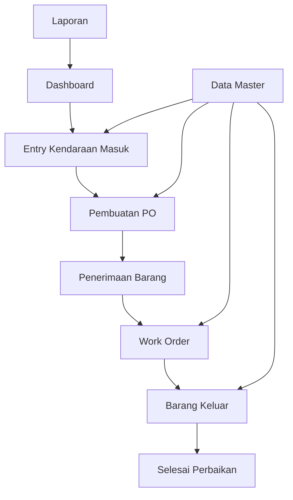

## 1. Product Overview
Aplikasi Monitoring Pagu Anggaran adalah sistem manajemen anggaran perbaikan dan perawatan kendaraan untuk institusi pemerintah atau perusahaan. Sistem ini membantu mengelola data master kendaraan, barang/jasa, anggaran, pekerjaan, supplier, dan mekanik serta proses transaksi dari entry kendaraan sampai pengeluaran sparepart.

Aplikasi ini menyelesaikan masalah pengelolaan anggaran perbaikan kendaraan yang manual dan tidak terintegrasi, memberikan transparansi penggunaan anggaran, serta memudahkan tracking perbaikan kendaraan dari awal sampai selesai.

Target pengguna adalah admin pergudangan, petugas perbaikan kendaraan, dan manajemen yang membutuhkan laporan penggunaan anggaran perbaikan kendaraan.

## 2. Core Features

### 2.1 User Roles
| Role | Registration Method | Core Permissions |
|------|---------------------|------------------|
| Admin | Default account | Full access to all menus dan data master |
| Petugas Gudang | Admin registration | Access menu master data, PO, penerimaan barang, barang keluar |
| Petugas Bengkel | Admin registration | Access entry kendaraan, work order, mekanik |
| Viewer | Admin registration | Read-only access ke semua laporan |

### 2.2 Feature Module
Aplikasi Monitoring Pagu Anggaran terdiri dari halaman-halaman utama:
1. **Dashboard**: Tampilan utama dengan ringkasan anggaran, grafik penggunaan, dan quick access ke menu utama.
2. **Data Master Kendaraan**: Form input dan list data kendaraan dengan informasi lengkap.
3. **Data Master Barang/Jasa**: Pengelolaan barang dan jasa dengan kode otomatis.
4. **Data Master Anggaran**: Setup anggaran periode dan group perbaikan.
5. **Data Master Pekerjaan**: Daftar jenis pekerjaan perbaikan dan service.
6. **Data Master Supplier**: Informasi supplier dan kontak person.
7. **Data Master Mekanik**: Daftar mekanik dengan spesialisasi kendaraan.
8. **Entry Kendaraan Masuk**: Pencatatan kendaraan yang masuk untuk perbaikan.
9. **Purchase Order (PO)**: Pembuatan PO untuk sparepart yang dibutuhkan.
10. **Penerimaan Barang**: Penerimaan sparepart dari supplier dengan update stok otomatis.
11. **Work Order**: Penugasan perbaikan ke mekanik dengan detail pekerjaan.
12. **Barang Keluar**: Pencatatan penggunaan sparepart dengan pengurangan stok otomatis.
13. **Laporan**: Berbagai laporan penggunaan anggaran, stok, dan history perbaikan.

### 2.3 Page Details
| Page Name | Module Name | Feature description |
|-----------|-------------|---------------------|
| Dashboard | Summary Cards | Menampilkan total anggaran tersedia, anggaran terpakai, sisa anggaran, dan jumlah kendaraan dalam perbaikan. |
| Dashboard | Chart Section | Grafik penggunaan anggaran per bulan dan per group (perbaikan/service ringan). |
| Dashboard | Quick Actions | Tombol cepat untuk entry kendaraan baru, buat PO, dan lihat work order aktif. |
| Data Master Kendaraan | Vehicle Form | Input/select jenis kendaraan (R4/R2/R2 Kecil), nomor polisi, nomor rangka, nomor mesin, nomor lambung, merk/type. |
| Data Master Kendaraan | Vehicle List | Tabel daftar kendaraan dengan fitur search, filter, edit, dan delete. |
| Data Master Barang/Jasa | Goods Form | Kode barang otomatis generate, input nama barang, satuan, select tipe (persediaan/non-persediaan). |
| Data Master Barang/Jasa | Goods List | Tabel daftar barang/jasa dengan informasi stok tersedia. |
| Data Master Anggaran | Budget Setup | Select bulan (Januari-Desember), input tahun, select group (perbaikan/service ringan), select jenis kendaraan. |
| Data Master Anggaran | Budget Allocation | Input nominal anggaran untuk setiap kombinasi periode dan group. |
| Data Master Pekerjaan | Job Form | Input nama pekerjaan/perbaikan, select group (perbaikan/service ringan). |
| Data Master Pekerjaan | Job List | Daftar pekerjaan yang dapat dipilih saat entry kendaraan. |
| Data Master Supplier | Supplier Form | Input nama supplier, PIC supplier, nomor telepon, alamat lengkap. |
| Data Master Supplier | Supplier List | Tabel supplier dengan informasi kontak. |
| Data Master Mekanik | Mechanic Form | Input nama mekanik, select spesialisasi (R4/R2/R2 Kecil/R4-R2/All), input nomor HP. |
| Data Master Mekanik | Mechanic List | Daftar mekanik dengan status ketersediaan. |
| Entry Kendaraan Masuk | Entry Form | Nomor referensi otomatis, tanggal masuk otomatis, select nomor polisi (auto-load data kendaraan), input nomor nota dinas, select group, select pekerjaan. |
| Entry Kendaraan Masuk | Sparepart Selection | Checkbox penggantian sparepart, jika dicentang muncul dialog untuk select barang dan input qty. |
| Purchase Order | PO Form | Nomor PO otomatis generate, select supplier, select nomor WO (auto-load data kendaraan, nota dinas, sparepart list). |
| Purchase Order | Item Details | Tabel sparepart dengan kode barang, nama barang, qty, harga satuan, total harga otomatis. |
| Penerimaan Barang | Receive Form | Select list PO/belum diterima, auto-load data kendaraan, nota dinas, no WO, daftar sparepart. |
| Penerimaan Barang | Receive Action | Checkbox untuk menerima semua/sebagian, otomatis update stok dan catat hutang. |
| Work Order | WO Form | Nomor WO otomatis, tanggal WO, select nomor nota dinas (belum di-WO), select mekanik. |
| Work Order | Job Details | Auto-load daftar pekerjaan dan sparepart, tambahan fitur add pekerjaan/sparepart tambahan. |
| Barang Keluar | Issue Form | Select nomor nota dinas, auto-load list WO dan sparepart yang tersedia. |
| Barang Keluar | Stock Deduction | Saat disimpan otomatis kurangi stok sparepart yang digunakan. |
| Laporan | Budget Report | Laporan realisasi anggaran per periode dengan detail penggunaan. |
| Laporan | Stock Report | Laporan stok sparepart masuk, keluar, dan sisa. |
| Laporan | Vehicle History | History perbaikan kendaraan lengkap dengan biaya. |

## 3. Core Process
### Flow Utama Aplikasi:
1. **Setup Data Master**: Admin menginput data kendaraan, barang/jasa, anggaran, pekerjaan, supplier, dan mekanik.
2. **Entry Kendaraan**: Petugas menerima kendaraan untuk perbaikan, menginput nota dinas dan jenis pekerjaan.
3. **Pembuatan PO**: Jika perlu sparepart, sistem generate PO berdasarkan kebutuhan yang sudah diinput.
4. **Penerimaan Barang**: Saat barang datang, petugas gudang menerima dan stok otomatis bertambah.
5. **Work Order**: Petugas bengkel membuat WO dan menugaskan mekanik.
6. **Pengeluaran Barang**: Saat perbaikan berlangsung, sparepart dikeluarkan dan stok berkurang.

## 4. User Interface Design
### 4.1 Design Style
- **Warna Utama**: Biru tua (#1e40af) untuk header dan primary actions
- **Warna Sekunder**: Abu-abu muda (#f3f4f6) untuk background, hijau (#10b981) untuk success, merah (#ef4444) untuk error
- **Style Tombol**: Rounded corners dengan shadow subtle, hover effect
- **Font**: Inter atau Roboto, ukuran 14px untuk body text, 16px untuk headers
- **Layout**: Sidebar navigation tetap di kiri, konten utama di kanan dengan card-based design
- **Icon**: Menggunakan Heroicons atau Lucide React untuk konsistensi

### 4.2 Page Design Overview
| Page Name | Module Name | UI Elements |
|-----------|-------------|-------------|
| Dashboard | Summary Cards | Card berwarna biru, hijau, orange dengan icon dan angka besar, shadow medium |
| Dashboard | Chart Section | Chart.js atau Recharts dengan warna gradient, legend di bawah |
| Entry Form | Form Layout | Form 2 kolom untuk desktop, 1 kolom untuk mobile, label di atas input |
| Data Tables | Table Design | Striped rows, sorting icons di header, action buttons dengan icon kecil |
| Select Dropdown | Custom Select | Searchable dropdown dengan debounce, loading state |
| Modal Dialog | Sparepart Selection | Modal medium size dengan tabel selectable, checkbox per row |

### 4.3 Responsiveness
Desktop-first design dengan breakpoint:
- Desktop: 1280px ke atas (sidebar tetap terbuka)
- Tablet: 768px - 1279px (sidebar bisa ditutup)
- Mobile: < 768px (sidebar menjadi bottom navigation)

Touch interaction dioptimalkan untuk tablet dengan tap target minimum 44px.

### 4.4 3D Scene Guidance
Tidak ada konten 3D dalam aplikasi ini.