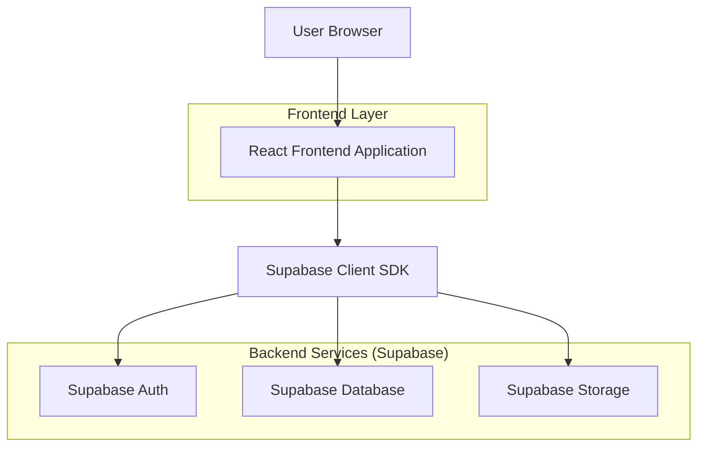
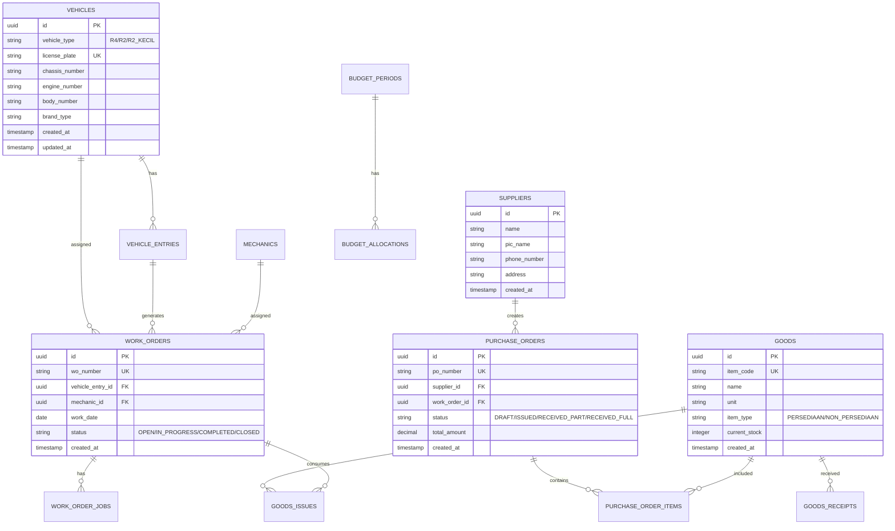

## 1. Architecture design



## 2. Technology Description
- Frontend: React@18 + tailwindcss@3 + vite
- Initialization Tool: vite-init
- Backend: Supabase (BaaS)
- Database: PostgreSQL (via Supabase)
- Authentication: Supabase Auth
- State Management: React Context + useReducer
- UI Components: Headless UI + Tailwind CSS
- Form Handling: React Hook Form + Zod validation
- Data Fetching: TanStack Query (React Query)

## 3. Route definitions
| Route | Purpose |
|-------|---------|
| / | Dashboard utama dengan ringkasan anggaran |
| /login | Halaman login untuk autentikasi user |
| /master/vehicles | Data master kendaraan |
| /master/goods | Data master barang/jasa |
| /master/budget | Setup anggaran periode |
| /master/jobs | Data master jenis pekerjaan |
| /master/suppliers | Data master supplier |
| /master/mechanics | Data master mekanik |
| /transactions/entry | Entry kendaraan masuk |
| /transactions/po | Purchase Order sparepart |
| /transactions/receive | Penerimaan barang dari supplier |
| /transactions/wo | Work Order perbaikan |
| /transactions/issue | Pengeluaran sparepart |
| /reports | Laporan penggunaan anggaran dan stok |
| /profile | Profil user dan pengaturan |

## 4. API definitions
### 4.1 Authentication API

```
POST /auth/v1/token
```

Request:
| Param Name| Param Type  | isRequired  | Description |
|-----------|-------------|-------------|-------------|
| email     | string      | true        | Email user |
| password  | string      | true        | Password user |

Response:
| Param Name| Param Type  | Description |
|-----------|-------------|-------------|
| access_token | string  | JWT token untuk autentikasi |
| refresh_token | string | Token untuk refresh session |
| user      | object      | Data user yang login |

### 4.2 Vehicle Management API

```
GET /rest/v1/vehicles
```

Query Parameters:
| Param Name| Param Type  | isRequired  | Description |
|-----------|-------------|-------------|-------------|
| select    | string      | false       | Kolom yang ingin diambil |
| order     | string      | false       | Urutan data |
| limit     | number      | false       | Jumlah data per halaman |

Response: Array of vehicle objects

```
POST /rest/v1/vehicles
```

Request Body:
```json
{
  "vehicle_type": "R4",
  "license_plate": "B1234XYZ",
  "chassis_number": "123456789",
  "engine_number": "987654321",
  "body_number": "BODY123",
  "brand_type": "Toyota Avanza"
}
```

## 5. Server architecture diagram
Tidak ada server backend khusus karena menggunakan Supabase BaaS. Semua logika bisnis dihandle di frontend dengan Supabase Client SDK.

## 6. Data model

### 6.1 Data model definition


### 6.2 Data Definition Language

Users Table (auth.users via Supabase)
```sql
-- Vehicle table
CREATE TABLE vehicles (
    id UUID PRIMARY KEY DEFAULT gen_random_uuid(),
    vehicle_type VARCHAR(10) NOT NULL CHECK (vehicle_type IN ('R4', 'R2', 'R2_KECIL')),
    license_plate VARCHAR(20) UNIQUE NOT NULL,
    chassis_number VARCHAR(50),
    engine_number VARCHAR(50),
    body_number VARCHAR(50),
    brand_type VARCHAR(100),
    created_at TIMESTAMP WITH TIME ZONE DEFAULT NOW(),
    updated_at TIMESTAMP WITH TIME ZONE DEFAULT NOW()
);

-- Goods/Items table
CREATE TABLE goods (
    id UUID PRIMARY KEY DEFAULT gen_random_uuid(),
    item_code VARCHAR(20) UNIQUE NOT NULL DEFAULT 'BRG-' || TO_CHAR(NOW(), 'YYYYMMDD') || '-' || LPAD(NEXTVAL('item_code_seq')::TEXT, 4, '0'),
    name VARCHAR(200) NOT NULL,
    unit VARCHAR(50) NOT NULL,
    item_type VARCHAR(20) NOT NULL CHECK (item_type IN ('PERSEDIAAN', 'NON_PERSEDIAAN')),
    current_stock INTEGER DEFAULT 0,
    created_at TIMESTAMP WITH TIME ZONE DEFAULT NOW()
);

-- Suppliers table
CREATE TABLE suppliers (
    id UUID PRIMARY KEY DEFAULT gen_random_uuid(),
    name VARCHAR(200) NOT NULL,
    pic_name VARCHAR(100),
    phone_number VARCHAR(20),
    address TEXT,
    created_at TIMESTAMP WITH TIME ZONE DEFAULT NOW()
);

-- Mechanics table
CREATE TABLE mechanics (
    id UUID PRIMARY KEY DEFAULT gen_random_uuid(),
    name VARCHAR(100) NOT NULL,
    specialization VARCHAR(20) NOT NULL CHECK (specialization IN ('R4', 'R2', 'R2_KECIL', 'R4_R2', 'ALL')),
    phone_number VARCHAR(20),
    created_at TIMESTAMP WITH TIME ZONE DEFAULT NOW()
);

-- Budget periods table
CREATE TABLE budget_periods (
    id UUID PRIMARY KEY DEFAULT gen_random_uuid(),
    month VARCHAR(20) NOT NULL,
    year INTEGER NOT NULL,
    UNIQUE(month, year),
    created_at TIMESTAMP WITH TIME ZONE DEFAULT NOW()
);

-- Vehicle entries table
CREATE TABLE vehicle_entries (
    id UUID PRIMARY KEY DEFAULT gen_random_uuid(),
    entry_number VARCHAR(30) UNIQUE NOT NULL DEFAULT 'ENT-' || TO_CHAR(NOW(), 'YYYYMMDD') || '-' || LPAD(NEXTVAL('entry_number_seq')::TEXT, 4, '0'),
    vehicle_id UUID REFERENCES vehicles(id),
    entry_date DATE NOT NULL,
    reference_number VARCHAR(50),
    service_group VARCHAR(20) NOT NULL CHECK (service_group IN ('PERBAIKAN', 'SERVICE_RINGAN')),
    notes TEXT,
    created_at TIMESTAMP WITH TIME ZONE DEFAULT NOW()
);

-- Purchase orders table
CREATE TABLE purchase_orders (
    id UUID PRIMARY KEY DEFAULT gen_random_uuid(),
    po_number VARCHAR(30) UNIQUE NOT NULL DEFAULT 'PO-' || TO_CHAR(NOW(), 'YYYYMMDD') || '-' || LPAD(NEXTVAL('po_number_seq')::TEXT, 4, '0'),
    supplier_id UUID REFERENCES suppliers(id),
    work_order_id UUID,
    status VARCHAR(30) DEFAULT 'DRAFT' CHECK (status IN ('DRAFT', 'ISSUED', 'RECEIVED_PART', 'RECEIVED_FULL')),
    total_amount DECIMAL(15,2) DEFAULT 0,
    created_at TIMESTAMP WITH TIME ZONE DEFAULT NOW()
);

-- Work orders table
CREATE TABLE work_orders (
    id UUID PRIMARY KEY DEFAULT gen_random_uuid(),
    wo_number VARCHAR(30) UNIQUE NOT NULL DEFAULT 'WO-' || TO_CHAR(NOW(), 'YYYYMMDD') || '-' || LPAD(NEXTVAL('wo_number_seq')::TEXT, 4, '0'),
    vehicle_entry_id UUID REFERENCES vehicle_entries(id),
    mechanic_id UUID REFERENCES mechanics(id),
    work_date DATE NOT NULL,
    status VARCHAR(30) DEFAULT 'OPEN' CHECK (status IN ('OPEN', 'IN_PROGRESS', 'COMPLETED', 'CLOSED')),
    created_at TIMESTAMP WITH TIME ZONE DEFAULT NOW()
);

-- Supabase Row Level Security (RLS) Policies
ALTER TABLE vehicles ENABLE ROW LEVEL SECURITY;
ALTER TABLE goods ENABLE ROW LEVEL SECURITY;
ALTER TABLE suppliers ENABLE ROW LEVEL SECURITY;
ALTER TABLE mechanics ENABLE ROW LEVEL SECURITY;

-- Grant permissions
GRANT SELECT ON vehicles TO anon;
GRANT ALL PRIVILEGES ON vehicles TO authenticated;
GRANT SELECT ON goods TO anon;
GRANT ALL PRIVILEGES ON goods TO authenticated;
GRANT SELECT ON suppliers TO anon;
GRANT ALL PRIVILEGES ON suppliers TO authenticated;
GRANT SELECT ON mechanics TO anon;
GRANT ALL PRIVILEGES ON mechanics TO authenticated;

-- Create indexes for performance
CREATE INDEX idx_vehicles_license_plate ON vehicles(license_plate);
CREATE INDEX idx_vehicles_type ON vehicles(vehicle_type);
CREATE INDEX idx_goods_item_code ON goods(item_code);
CREATE INDEX idx_goods_name ON goods(name);
CREATE INDEX idx_vehicle_entries_date ON vehicle_entries(entry_date);
CREATE INDEX idx_purchase_orders_status ON purchase_orders(status);
CREATE INDEX idx_work_orders_status ON work_orders(status);
CREATE INDEX idx_work_orders_mechanic ON work_orders(mechanic_id);